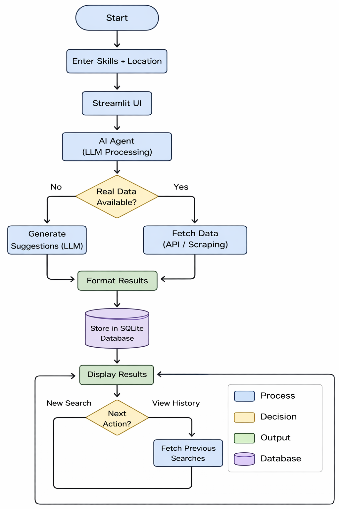

# AI Internship Finder Agent

An AI-powered agent that helps students discover relevant internship roles based on their skills and preferred location.

> Built as part of the AI Agents for India Track under GirlScript Summer of Code 2026.

---

## Overview

This project simplifies internship discovery by using AI to generate personalized internship role suggestions instantly.

---

## Problem Statement

Students often struggle to:
- Find relevant internships  
- Filter opportunities based on skills  
- Get quick and personalized suggestions  

---

## Solution

This AI agent:
- Takes user input (skills and location)
- Uses an LLM (Mistral API) to understand the query
- Generates concise internship role suggestions
- Displays results in a clean user interface

---

## Features (Phase 1)

- Skill-based internship suggestions  
- Location-based filtering  
- AI-powered recommendations using Mistral  
- Interactive UI using Streamlit  
- Clean card-based result display  
- Optimized prompt for structured output  

---

## Tech Stack

- Python  
- Streamlit  
- Mistral API  
- python-dotenv  

---

## System Workflow

---

## Getting Started

### 1. Install Dependencies
pip install -r requirements.txt

### 2. Add API Key
Create a .env file and add:
MISTRAL_API_KEY=your_api_key_here

### 3. Run the Application
streamlit run app.py

---

## Current Status

Phase 1 completed:  
- Core AI agent implemented  
- UI developed  
- Prompt optimization completed  

---

## Upcoming Features

- Database integration for search history  
- Regeneration and caching  
- Agent evaluation metrics  
- User authentication  
- AI-based resume builder  

---

## Author

Ronit Maheshwari